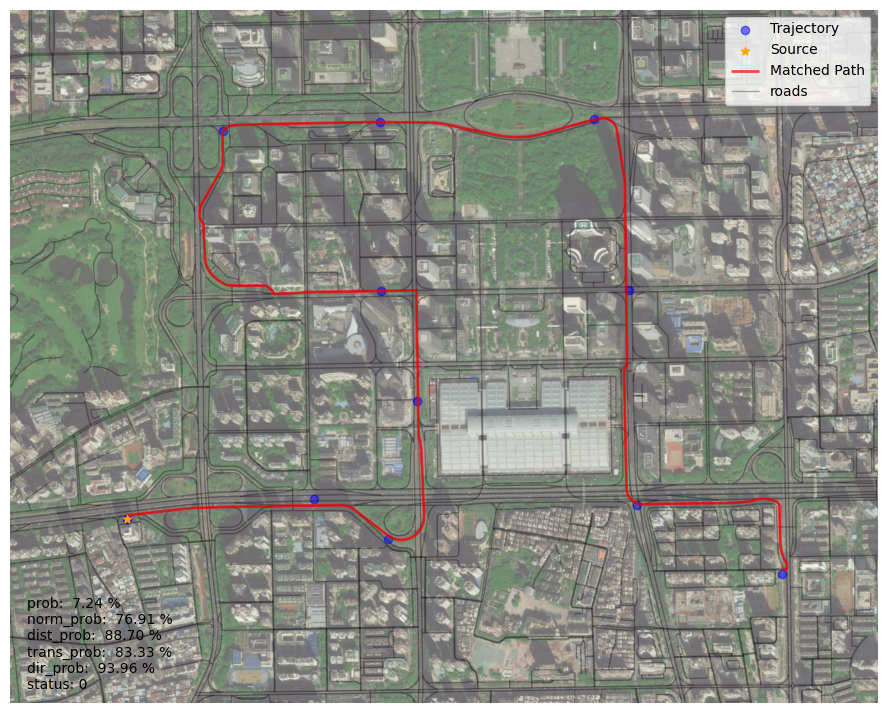

# ST-MapMatching

## 版本

1.0

## 描述

基于时间和空间特性的全局地图匹配算法（ST-Matching），一种针对低采样率的GPS轨迹的新颖全局地图匹配算法。算法的基础路网信息源为 [OSM](https://wiki.openstreetmap.org/wiki/Main_Page)，可通过`DigraphOSM`自动下载。算法匹配过程考虑以下两个方面特征：

1. 道路网络的空间几何和拓扑结构

2. 轨迹的速度/时间约束。基于时空分析，构建候选图，从中确定最佳匹配路径。

输入WGS坐标系的`GPS轨迹点集`，输出途径的路段；

本算法为 MSRA《[Map-Matching for Low-Sampling-Rate GPS Trajectories](https://www.microsoft.com/en-us/research/publication/map-matching-for-low-sampling-rate-gps-trajectories/)》的复现，中文解读可参考 [CSDN文章](https://blog.csdn.net/qq_43281895/article/details/103145327)。

## 调用说明

详见 `./src/main.py`

```python
from DigraphOSM import DigraphOSM
from MapMathing import ST_Matching

# step 1: 获取/加载道路网络
from setting import PCL_BBOX
network = DigraphOSM("PCL", bbox=PCL_BBOX)
# 导入`深圳市预处理路网`代码如下
# network = DigraphOSM("Shenzhen", resume='../input/ShenzhenNetwork.pkl')

# step 2: 创建地图匹配 matcher
matcher = ST_Matching(net=network)

# step 3: 加载轨迹点集合，以打石一路为例
traj = matcher.load_points("../debug/traj_debug_dashiyilu_0.geojson", in_sys='wgs')

# step 4: 开始匹配
path = matcher.matching(traj, plot=True, top_k=3, dir_trans=True, plot_scale=.01)
```

`深圳市预处理路网`下载地址: [百度云](https://pan.baidu.com/s/11aAoAkwkNoLmQScUjEssNw), 提取码：0rmq

### 输入示例

```json
{"type": "FeatureCollection",
"name": "trips",
"crs": { "type": "name", "properties": { "name": "urn:ogc:def:crs:OGC:1.3:CRS84" } },
"features": [
{ "type": "Feature", "properties": { "id": 0 }, "geometry": { "type": "Point", "coordinates": [ 114.042192099217814, 22.530825799254831 ] } },
{ "type": "Feature", "properties": { "id": 1 }, "geometry": { "type": "Point", "coordinates": [ 114.048087551857591, 22.53141414915628 ] } },
{ "type": "Feature", "properties": { "id": 2}, "geometry": { "type": "Point", "coordinates": [ 114.050457097022772, 22.530254493344991 ] } },
{ "type": "Feature", "properties": { "id": 3}, "geometry": { "type": "Point", "coordinates": [ 114.051374300525396, 22.534269663922935 ] } },
{ "type": "Feature", "properties": { "id": 4}, "geometry": { "type": "Point", "coordinates": [ 114.050237176637481, 22.537490331019249 ] } },
{ "type": "Feature", "properties": { "id": 5}, "geometry": { "type": "Point", "coordinates": [ 114.045217471559866, 22.54216729753638 ] } },
{ "type": "Feature", "properties": { "id": 6}, "geometry": { "type": "Point", "coordinates": [ 114.050182240637483, 22.542416259019245 ] } },
{ "type": "Feature", "properties": { "id": 7}, "geometry": { "type": "Point", "coordinates": [ 114.056957680637467, 22.542526131019244 ] } },
{ "type": "Feature", "properties": { "id": 8}, "geometry": { "type": "Point", "coordinates": [ 114.058074914718418, 22.537513356219687 ] } },
{ "type": "Feature", "properties": { "id": 9}, "geometry": { "type": "Point", "coordinates": [ 114.058331080637473, 22.531227627019256 ] } },
{ "type": "Feature", "properties": { "id": 10}, "geometry": { "type": "Point", "coordinates": [ 114.062890768637473, 22.529213307019258 ] } }
]
}
```

注:

1. 示例输入对应`input/traj_0.geojson`，在`vscode`中可借助插件`Geo Data Viewer`可视化;
2. 输入轨迹点的坐标系默认为 wgs84, gcj02的轨迹需在调用函数`load_points`加载明确坐标系`in_sys=gcj`,

### 输出示例

```json
{
"type": "FeatureCollection",
"features": [
{ "type": "Feature", "properties": { "s": 1491845271, "e": 1491845278, "eid": 42012, "rid": 135913043, "name": "滨河大道辅路", "road_type": "primary", "dir": 1, "memo": "first step" }, "geometry": { "type": "LineString", "coordinates": [ [ 114.042179811625786, 22.530929457614068 ], [ 114.0425387, 22.530972 ] ] } },
{ "type": "Feature", "properties": { "s": 1491845278, "e": 499265789, "eid": 54662, "rid": 40971700, "name": "滨河大道辅路", "road_type": "primary", "dir": 1, "memo": null }, "geometry": { "type": "LineString", "coordinates": [ [ 114.0425387, 22.530972 ], [ 114.0435665, 22.5310824 ] ] } },
...,
{ "type": "Feature", "properties": { "s": 500020999, "e": 7707208812, "eid": 41147, "rid": 41019611, "name": "福强路", "road_type": "primary", "dir": 1, "memo": null }, "geometry": { "type": "LineString", "coordinates": [ [ 114.0629848, 22.529529 ], [ 114.0629879, 22.5293539 ] ] } },
{ "type": "Feature", "properties": { "s": 7707208812, "e": 7640452829, "eid": 41148, "rid": 41019611, "name": "福强路", "road_type": "primary", "dir": 1, "memo": "last step" }, "geometry": { "type": "LineString", "coordinates": [ [ 114.0629879, 22.5293539 ], [ 114.062991016718641, 22.52921556564154 ] ] } }
]
}

```

可视化效果如下


## 环境安装

详见 requirement.txt, 建议`geopandas`使用conda安装

```bash
conda create -n geo python=3.6
conda activate geo
conda install geopandas==0.8.1
```

## Ref

- batched compression algorithm
  [轨迹数据压缩的Douglas-Peucker算法](https://zhuanlan.zhihu.com/p/136286488)
  [基于MapReduce的轨迹压缩并行化方法](http://www.xml-data.org/JSJYY/2017-5-1282.htm)
